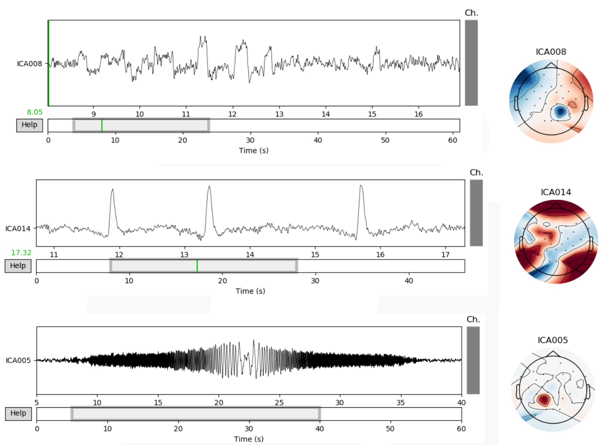

## Data 
The data was collected during an experiment at Universidad Rey Juan Carlos (URJC), capturing EEG signals as subjects viewed 6 public health campaign advertisements. It encompasses signals from 32 dry electrodes, capturing brain activity during ad viewing.

## Project structure
This repository comprises several key files:
- Exploratory Data Analysis.ipynb: initial exploration of the dataset's structure.
- Experiments with linear filters.ipynb:  investigations into basic filtering parameters.
- Subject X.ipynb: application of ICA filtering and AWI analysis for each subject.
- Approach Withdrawal Index Graph.ipynb: generation of graphs depicting the AWI for all subjects.
- TFG_utils.py: contains relevant functions for the project.

The project's objectives are:

- **Preprocessing EEG signals**: using basic linear filters and advanced techniques such as Independent Component Analysis (ICA).
- **Extracting an index**: to evaluate individual responses to various advertisements using spectral analysis techniques, specifically focusing on the alpha frequency band power.

## Results
The filtering routine that yields the best results involves applying a BPF with lower and upper cutoff frequencies of 2 and 40 Hz respectively, along with a 50 Hz Notch filter. 

Additionally, the ICA technique proved highly useful for detecting ocular artifacts and other irregularities introduced by certain electrodes. 
- The first figure shows an independent component detecting eye movement artifact, with a distinct wave pattern resembling a dipole between frontal areas of both hemispheres.
- In the middle figure, another independent component captures blinking, correlating this pattern with a frontal brain area weight distribution.
- Lastly, the third independent component captures electrode-induced noise, easily identifiable due to its punctual nature.

The project's final phase focuses on deriving the neurometric approach-withdrawal index (AWI), assessing prefrontal activity differences in the alpha band between brain hemispheres. Calculated from alpha power at electrodes F3 and F7 (right hemisphere) and F4 and F8 (left hemisphere), this index aims to compare each subject's response to advertisements, determining their level of impact or rejection. However, analysis of the AWI produced unsatisfactory results, likely due to the small sample size and substantial value variability. Additionally, the absence of relevant literature on reference values complicates drawing conclusive insights.

## Notes
The project's code is developed in Python using Jupyter Notebook and Spyder environments, with the MNE module extensively used for neurophysiological data analysis.

## ¡Let's connect! 

October 2020
