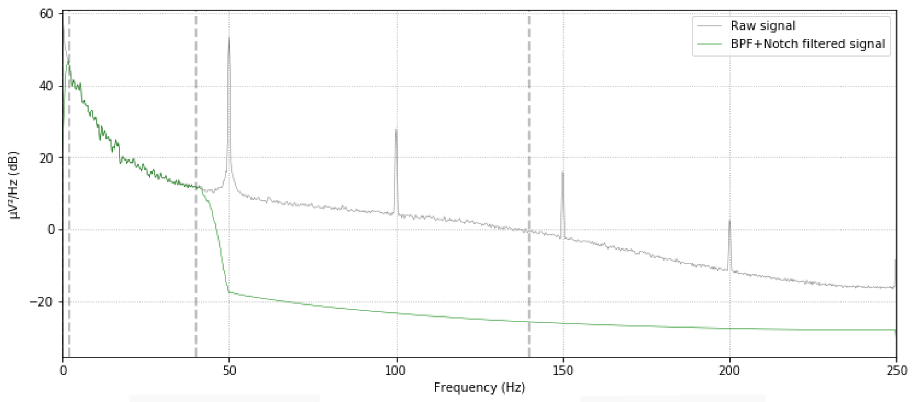

## Dataset
The data was collected during an experiment at Universidad Rey Juan Carlos (URJC), capturing EEG signals as subjects viewed various public health campaign advertisements. It encompasses signals from 32 dry electrodes, capturing brain activity during ad viewing.

## Objectives
- **Preprocessing EEG signals**: using basic linear filters and advanced techniques such as Independent Component Analysis (ICA).
- **Extracting an index**: to evaluate individual responses to various advertisements using spectral analysis techniques, specifically focusing on the alpha frequency band power.

## Methodology
The project's code is developed in Python using Jupyter Notebook and Spyder environments, with the MNE module extensively used for neurophysiological data analysis.

## Results

The filtering routine that yields the best results involves applying a BPF with lower and upper cutoff frequencies of 2 and 40 Hz respectively, along with a 50 Hz Notch filter. 

Additionally, the ICA technique proved highly useful for detecting ocular artifacts and other irregularities introduced by certain electrodes, although it is acknowledged to be somewhat subjective and slow. 

The final part of the project involves extracting the neurometric index of approach-withdrawal, which measures the difference in prefrontal activity in the alpha band between both brain hemispheres. This is calculated using the power corresponding to the alpha frequency range at electrodes F3 and F7 of the right hemisphere, and F4 and F8 of the left hemisphere. The objective of this index is to establish comparative relationships between the resulting values for each advertisement per subject, thereby determining which ads evoke more rejection or impact and which ones less. The analysis of the AWI yielded unsatisfactory results, perhaps due to the small sample size and significant variability in the values. Furthermore, no related bibliography regarding reference values for this index was found, making it challenging to draw definitive conclusions at this time.

